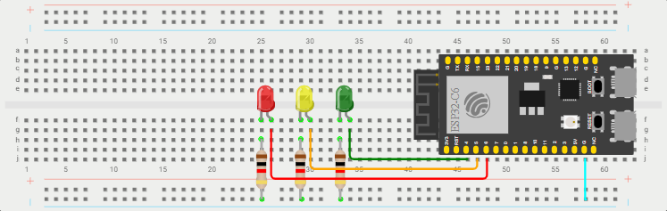

# Paquete de Soporte de Placa (Board-Support Package / BSP)

Este componente contiene los controladores (drivers) específicos para los componentes de hardware externos conectados a la placa de desarrollo **ESP32-C6-DevKitC-1**. 

En este ejemplo, el BSP da soporte a **3 LEDs externos** cableados en una protoboard.

---

## Conexiones de Hardware

A continuación se detalla la correspondencia entre los pines GPIO del ESP32-C6 y los LEDs en la protoboard:

| LED | Color | GPIO del ESP32-C6 | Identificador en Código |
| :---: | :---: | :---: | :---: |
| **LED 1** | Verde 🟢 | **GPIO 4** | `LED_1` |
| **LED 2** | Amarillo 🟡 | **GPIO 5** | `LED_2` |
| **LED 3** | Rojo 🔴 | **GPIO 6** | `LED_3` |

### Esquema de Conexión en Protoboard

---

## Interfaz de Programación (API)

La cabecera [led.h](./inc/led.h) define las funciones para controlar los LEDs de manera abstracta:

* **`uint8_t LedsInit(void)`**: Inicializa los pines GPIO correspondientes como salidas digitales (utilizando el driver HAL de GPIO) y apaga todos los LEDs.
* **`uint8_t LedOn(led_t led)`**: Enciende el LED indicado (ej. `LED_1`).
* **`uint8_t LedOff(led_t led)`**: Apaga el LED indicado.
* **`uint8_t LedToggle(led_t led)`**: Invierte el estado del LED indicado.
* **`uint8_t LedsOffAll(void)`**: Apaga todos los LEDs simultáneamente.
* **`uint8_t LedsMask(uint8_t mask)`**: Controla el estado de los tres LEDs usando una máscara de bits (donde el bit 0 representa el `LED_3`, el bit 1 el `LED_2` y el bit 2 el `LED_1`).

